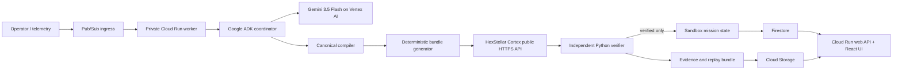

# Constellation

> **Say the mission. Prove the plan.**


Constellation answers a simple question: when an orbital compute network breaks, can AI create a
replacement schedule without quietly breaking another rule?

The demo separates that job into three parts:

1. **Gemini turns the operator's words into a checklist.** It identifies required work, deadlines,
   failed hardware, and the one priority that needs human clarification.
2. **HexStellar Cortex compares complete recovery plans.** It searches combinations of schedule
   pieces while respecting the formal contract.
3. **A separate Python program checks the answer minute by minute.** If a job is missed, a station is
   double-booked, a deadline is late, or failed hardware is used, the plan cannot update the sandbox.

No system grades its own homework. Gemini cannot approve its proposal, Cortex cannot change the
mission, and the independent checker only unlocks the exact plan it checked.

## Why this matters

An AI-generated plan can sound convincing while hiding a small but serious mistake. One contact can
overlap another. A job can finish after its deadline. A failed computer can accidentally reappear.
Those mistakes are hard to spot in prose and easy to find when the plan becomes a testable software
contract.

Constellation turns a plausible answer into an inspectable answer. A judge can watch the work happen,
open the exact failure when a rule is broken, download every input and receipt, and rerun the checker
without Gemini, Cortex, or an internet connection.

## The 20-second mental model

Think of four separate roles:

1. **Gemini 3.5 Flash is the translator.** It turns an operator's sentence into a visible checklist.
   It does not choose or approve the recovery schedule.
2. **Cortex is the planner.** It receives a structured data puzzle made from candidate schedule pieces,
   required obligations, conflicts, costs, forced choices, and forbidden resources. It does not receive
   authority to interpret the operator's intent or mutate the mission.
3. **Python is the inspector.** Independent source code replays the complete timeline and reports a
   concrete counterexample when a declared rule fails. It cannot repair a candidate to make it pass.
4. **SHA-256 is the tamper seal.** The sandbox update requires the current mission version, canonical
   input fingerprint, plan fingerprint, and verification fingerprint to match.

The verifier proves that the formalized checklist was obeyed. It cannot know that an operator meant
something they never confirmed. That is why Constellation displays the extracted rules, pauses on a
material ambiguity, and changes the fingerprint whenever the accepted meaning changes.

## What Cortex actually receives and returns

A candidate schedule piece can represent a complete local sequence such as running a job on one
satellite, storing its output, and sending that output through a compatible ground station during an
allowed window. Cortex selects a set of pieces under the submitted public contract.

The input declares:

- work that must be covered;
- hardware that must not be used;
- choices that cannot coexist;
- commitments that must stay fixed; and
- costs such as delay and disruption.

The response contains selected identifiers, coverage and violation fields, declared cost fields, the
assurance Cortex actually returned, a receipt, and live operational measurements when available.
Constellation never promotes that assurance label. A separate checker still recomputes the complete
mission properties in the original domain.

Cortex executes supported contracts on HexStellar managed accelerated infrastructure. A live response
can report engine time and peak RSS, and the interface displays those fields exactly as returned. One
run is operational telemetry, not a comparative benchmark. The project therefore does not claim a
speedup multiplier, universal acceleration, or global optimality without the corresponding controlled
evidence.

Precision has a narrow, testable meaning here: the request is structured, constraints are explicit,
the response is machine-readable, the assurance is preserved, and independent code recomputes the
properties required before action.

## What is simulated and what actually runs

The satellites, collision, stations, orbital geometry, batteries, storage, and sandbox are a
deterministic research scenario. They explain and stress the workflow; they are not real spacecraft
telemetry or evidence of physical flight safety.

The compiler, public Cortex adapter, Python checker, fingerprints, artifacts, and apply lock are
executable software. In a run labeled `live`, the backend submits the formal `cover` contract to the
external Cortex HTTPS service and preserves its sanitized response and receipt. A local or fallback
run is visibly labeled and is never presented as proof of a live Cortex call.

“Independent checker” means separate from the planner. The verifier does not import the HexStellar
client, call Cortex, call Gemini, or change the candidate. It is project-authored inspectable code,
not a third-party certification.

## Recheck it on the website or offline

The Evidence Room has a **Run independent check again** button. It sends only the already frozen
mission data to the Python verifier. It does not call Gemini or Cortex. The same panel can display and
download the exact `verifier.py` source shipped in the running deployment.

Every new replay ZIP also includes `VERIFIER-SOURCE.py`, `AI-REVIEW-PROMPT.md`, all input and result
files, and a checksum manifest. The offline command verifies the frozen evidence package. It does not
rerun Gemini or Cortex and therefore does not claim those services are deterministic.

The visual story does not wait for an unexplained click. When the live map enters the screen, it
briefly shows the healthy network, starts the simulated impact, centers the affected satellite, and
then shows the checked recovery when one is available. **Replay failure** restarts that sequence.
Selecting any named view immediately gives control to the visitor and stops the automatic story.
The Earth opens on North and South America, the mission panel leaves most of the width to the map,
and a lost WebGL context is rebuilt once automatically before a visible retry control appears.

Start with the [60 second judge guide](docs/JUDGE_GUIDE.md), read
[how Cortex works](https://docs.hexstellar.com/), or inspect the
[public HexStellar CLI/client](https://github.com/brayonpi/hexstellar).

## What the demo proves

The primary scenario is a deterministic software simulation with 12 satellites, four ground stations,
24 compute jobs, 36 communication windows, storage and energy limits, required health checks, and a
valid starting schedule. A Pub/Sub event removes one ground station and isolates two compute nodes
while an urgent job arrives.

The application then:

1. freezes the operator's meaning as a fingerprinted `MissionIntent`;
2. pauses because the missing priority would change which plan wins;
3. creates deterministic, locally checked schedule pieces;
4. sends a public `cover` contract to the HexStellar Cortex HTTPS API;
5. separately replays every declared scheduling and resource rule;
6. updates only the sandbox, and only after every rule passes; and
7. exposes the plan change, Cortex receipt, exact failures, fingerprints, logs, and replay ZIP.

Here, **verified** has a narrow meaning: the committed Python checker passed its declared rules for
this exact simulated input and plan. It does not mean real spacecraft are safe, every sentence is
understood perfectly, or the combined plan is globally optimal.

The clarification is not decorative. Choosing the urgent deadline produces the successful golden
path. Choosing every lower-priority download changes both the formal rules and the fingerprint, then
stops before Cortex because the fixture cannot prove that every previously computed output exists.
That explicit abstention prevents the application from inventing missing mission state.

## See Cortex for yourself

**Cortex is not a language model.**
Gemini interprets the operator's words.
Cortex receives a structured computational contract made from obligations, conflicts, costs,
required choices, and forbidden choices.
The public service executes supported contracts on HexStellar managed accelerated infrastructure,
then returns a structured result, measured execution fields, a receipt, and the assurance it actually earned.
In this project, precision means that the request and response are formal and that a separate program
checks the complete timeline.
It is not a universal speed or global optimality claim.

- [How Cortex works](https://docs.hexstellar.com/) explains the public contract, outputs, certainty
  labels, and verification workflow.
- [Worked examples](https://docs.hexstellar.com/examples/) show the public problem interfaces in use.
- [HexStellar CLI/client](https://github.com/brayonpi/hexstellar) is the public repository judges and
  engineers can inspect. It is the supported client boundary, not the proprietary Cortex engine.
- [Constellation source](https://github.com/brayonpi/constellation-gemini) is intentionally private during
  development and will become anonymously accessible only after the release audit and owner approval.

## Quick start

Requirements: Python 3.12+, Node.js 20+, and npm.

```bash
cp .env.example .env
python3 -m venv .venv
.venv/bin/python -m pip install -e '.[dev]'
cd apps/web && npm ci && cd ../..
./scripts/dev.sh
```

Open `http://localhost:5173`.
Local mode is fully usable without cloud credentials and is visibly labeled `Local development mode`.
It uses a bounded local cover fallback and a committed structured intent fixture; it never represents either one as a live Gemini or Cortex result.
Scroll to the live map to start the visual incident automatically, or use **Replay failure** at any time.

Run the tests:

```bash
.venv/bin/python -m pytest
cd apps/web && npm run typecheck && npm run test
```

Verify a downloaded replay independently:

```bash
PYTHONPATH=apps/api .venv/bin/python -m constellation.verify_bundle artifacts/mission-replay.zip
```

If a judge or engineer wants an AI-assisted audit, use [AI_REVIEW_GUIDE.md](AI_REVIEW_GUIDE.md).
The same adversarial prompt ships inside every replay ZIP as `AI-REVIEW-PROMPT.md`; it asks the AI to validate checksums, trace trust boundaries, recompute declared properties, report blockers, and narrow unsupported claims.

## Live integration

Set the variables in `.env.example`:

- `GOOGLE_CLOUD_PROJECT`, `GOOGLE_CLOUD_LOCATION`, and `GOOGLE_GENAI_USE_VERTEXAI=TRUE` enable Vertex AI through Google ADK.
- `HEXSTELLAR_API_URL` and `HEXSTELLAR_API_KEY` enable the public Cortex HTTPS path.
- `CONSTELLATION_MODE=cloud` selects Firestore and the deployed event-driven worker path.

Production keeps the HexStellar key in Secret Manager and never sends it to the browser.
The Cortex adapter posts a stable idempotency key, treats `202` as queued success, follows the returned poll URL, retries only bounded transient failures, and preserves the returned certainty unchanged.

## Architecture




See the [Judge guide](docs/JUDGE_GUIDE.md), [Architecture](docs/ARCHITECTURE.md),
[Security](docs/SECURITY.md), [Claims and limitations](docs/CLAIMS_AND_LIMITATIONS.md),
[Evidence language](docs/EVIDENCE.md), [Release inventory](docs/RELEASE_INVENTORY.md),
[Release audit](docs/RELEASE_AUDIT.md), and [Submission checklist](docs/SUBMISSION.md).

## Data and simulation boundaries

The application is designed to use a small reproducible slice of [Google Borg ClusterData 2019](https://github.com/google/cluster-data), licensed CC BY.
The committed CI fixture is currently trace-shaped and explicitly marked `fixture_only`; it is not represented as an extracted production trace.
The repository includes the BigQuery extraction template and provenance manifest that must be completed before the demo claim changes to “Borg-derived.”

Contact windows, ground stations, failures, energy budgets, storage budgets, orbital state, and mission objectives are deterministic project simulations.
Constellation does not reproduce the Borg scheduler, benchmark Google infrastructure, or control real spacecraft.

Constellation was inspired by public research about [Project Suncatcher](https://research.google/blog/exploring-a-space-based-scalable-ai-infrastructure-system-design/), [constellation scheduling](https://research.google/pubs/optimal-scheduling-of-a-constellation-of-earth-imaging-satellites-for-maximal-data-throughput-and-efficient-human-management/), and [Leaf Space on Google Cloud](https://cloud.google.com/blog/topics/startups/leaf-space-enabling-next-gen-satellites-on-google-cloud).
It is an independent simulated research prototype and is not affiliated with, endorsed by, or connected to Google or Project Suncatcher.

## Pre-existing technology disclosure

Constellation was created during the August 3 through 31, 2026 submission period for the All Things Agentic Hackathon.
HexStellar Cortex and its public API/client predate this project and are integrated as an external computational platform.
No proprietary HexStellar engine, runtime, internal benchmark, private prompt, activation artifact, or trade-secret implementation is included.

Constellation uses only the public `hexstellar==1.0.0` contract or public HTTPS API.
HexStellar Cortex and the HexStellar Enterprise Low-Energy Runtime are separate products.
The Enterprise Runtime does not execute this application, and no Enterprise energy or acceleration claim applies here.

## Assurance vocabulary

- `certified`: only the exact property or bound stated by the Cortex response or an identified checker.
- `verified`: the independent Constellation verifier recomputed the stated simulation property.
- `heuristic`: a valid candidate without a proof of optimality or convergence.
- `abstained`: the contract or evidence was insufficient.
- `local_deterministic`: bounded deterministic execution selected because the environment was explicitly started without live Cortex credentials.
- `offline_precomputed`: a committed contingency replay only; it is never used as a hidden replacement for a failed live request.
- `degraded_fixture`: structured interpretation fixture used when live Gemini is not configured or fails, with the reason persisted in evidence.

If Cortex is configured as live and becomes unavailable, the run stops in `CORTEX_UNAVAILABLE`.
Constellation does not silently replace that live request with local output.
The interface then offers two explicit choices: retry the live request, or run the same formal
scenario in a transparent deterministic simulation.
The simulation is labeled `local_deterministic`, receives local receipts, leaves Cortex engine
metrics empty, and must pass the same independent checker before the sandbox can change.

No combined `cover` + `qap` result is described as jointly globally optimal.

## Measured run telemetry

The mission view and replay bundle separate measurements that are often incorrectly merged:

- `elapsed_ms`: solver-engine compute time returned by the live Cortex response.
- `peak_rss_kb`: solver-engine peak resident memory returned by the live Cortex response.
- HTTPS round trip: Constellation's observed preflight, transport, queue/poll, and solve latency.
- full planning run: wall time inside the Constellation worker for that planning attempt.
- independent check: wall time spent replaying the final plan in the Python verifier.
- worker peak RSS: peak resident memory of the Constellation worker process since process start.

These are operational measurements for one identified run, not a cross-system benchmark.
Local deterministic mode leaves Cortex engine metrics empty instead of fabricating them.
The replay ZIP includes `runtime-telemetry.json`, receipts, platform scope, and checksums.

The 3D globe packages NASA Blue Marble surface and cloud textures locally.
They provide visual context only and are not orbital geometry or mission evidence; exact sources and
hashes are recorded in [`apps/web/public/earth/README.md`](apps/web/public/earth/README.md).

## Creator

Constellation was created by [Brayon Pieske](https://www.linkedin.com/in/brayonpieske/),
founder of [HexStellar](https://hexstellar.com/).
[TrustCarbon](https://trustcarbon.org/) is included only as a professional founder link and is not a
technology, sponsor, or dependency of this application.
No personal email address or telephone number is published in the project.

## License

Application code is Apache-2.0.
Third-party datasets and dependencies retain their own licenses; see [THIRD_PARTY_NOTICES.md](THIRD_PARTY_NOTICES.md).

> **BRAYON PIESKE** | *"Engineering earns trust when every claim is testable and every release is verified."*
