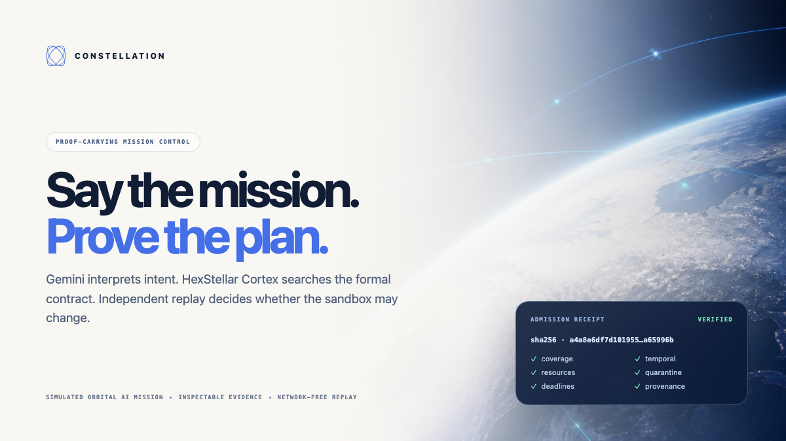
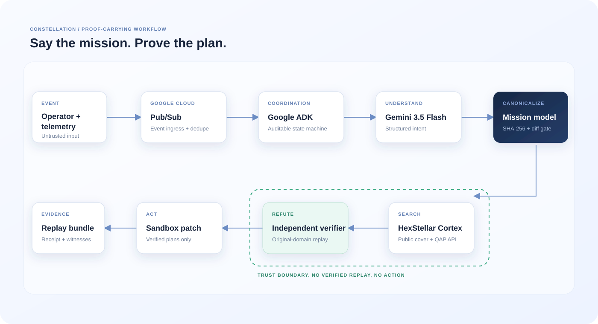
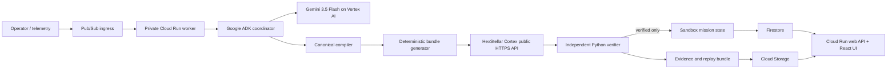

# Constellation

> **Say the mission. Prove the plan.**



Constellation is proof-carrying mission control for a deterministic orbital AI simulation.
Gemini 3.5 Flash interprets operator intent, Google ADK coordinates the workflow, HexStellar Cortex searches a declared combinatorial contract, and an independent Python verifier decides whether the resulting timeline may update the sandbox.

Constellation addresses a specific operational friction inside HexStellar research demonstrations: turning an event-driven change request into a reproducible recovery plan without manually reconciling compute, contact, storage, energy, deadline, and failure constraints.
After one materially necessary clarification, the workflow resumes autonomously from candidate generation through verification and sandbox mutation.

## What the demo proves

The primary scenario contains 12 simulated satellites, four synthetic ground stations, 24 trace-shaped compute workloads, 36 generated contact windows, storage and energy limits, required health contacts, and a valid nominal schedule.
A Pub/Sub event removes a ground station and isolates two compute resources while an urgent workload arrives.

The application then:

1. compiles operator text into a canonical `MissionIntent`;
2. pauses if the missing priority changes the objective order;
3. generates locally valid mission bundles deterministically;
4. submits a `cover` contract to the public HexStellar Cortex HTTPS API;
5. independently replays coverage, time, resources, quarantine, deadlines, provenance, and placement;
6. applies only a verified result to the sandbox; and
7. exposes the mission patch, Cortex receipt, counterexamples, hashes, and replay bundle.

“Verified” means only that the committed verifier established the properties reported in its check list for this deterministic simulation.
It does not mean physical spacecraft safety, general semantic correctness, or global optimality.

## Quick start

Requirements: Python 3.12+, Node.js 20+, and npm.

```bash
cp .env.example .env
python3 -m venv .venv
.venv/bin/python -m pip install -e '.[dev]'
cd apps/web && npm install && cd ../..
./scripts/dev.sh
```

Open `http://localhost:5173`.
Local mode is fully usable without cloud credentials and is visibly labeled `Local development mode`.
It uses a bounded local cover fallback and a committed structured intent fixture; it never represents either one as a live Gemini or Cortex result.

Run the tests:

```bash
.venv/bin/python -m pytest
cd apps/web && npm run typecheck && npm run test
```

Verify a downloaded replay independently:

```bash
PYTHONPATH=apps/api .venv/bin/python -m constellation.verify_bundle artifacts/mission-replay.zip
```

If a judge or engineer wants an AI-assisted audit, use [AI_REVIEW_GUIDE.md](AI_REVIEW_GUIDE.md).
The same adversarial prompt ships inside every replay ZIP as `AI-REVIEW-PROMPT.md`; it asks the AI to validate checksums, trace trust boundaries, recompute declared properties, report blockers, and narrow unsupported claims.

## Live integration

Set the variables in `.env.example`:

- `GOOGLE_CLOUD_PROJECT`, `GOOGLE_CLOUD_LOCATION`, and `GOOGLE_GENAI_USE_VERTEXAI=TRUE` enable Vertex AI through Google ADK.
- `HEXSTELLAR_API_URL` and `HEXSTELLAR_API_KEY` enable the public Cortex HTTPS path.
- `CONSTELLATION_MODE=cloud` selects Firestore and the deployed event-driven worker path.

Production keeps the HexStellar key in Secret Manager and never sends it to the browser.
The Cortex adapter posts a stable idempotency key, treats `202` as queued success, follows the returned poll URL, retries only bounded transient failures, and preserves the returned certainty unchanged.

## Architecture





See [Architecture](docs/ARCHITECTURE.md), [Security](docs/SECURITY.md), [Claims and limitations](docs/CLAIMS_AND_LIMITATIONS.md), [Evidence language](docs/EVIDENCE.md), [Release inventory](docs/RELEASE_INVENTORY.md), [Release audit](docs/RELEASE_AUDIT.md), and [Submission checklist](docs/SUBMISSION.md).

## Data and simulation boundaries

The application is designed to use a small reproducible slice of [Google Borg ClusterData 2019](https://github.com/google/cluster-data), licensed CC BY.
The committed CI fixture is currently trace-shaped and explicitly marked `fixture_only`; it is not represented as an extracted production trace.
The repository includes the BigQuery extraction template and provenance manifest that must be completed before the demo claim changes to “Borg-derived.”

Contact windows, ground stations, failures, energy budgets, storage budgets, orbital state, and mission objectives are deterministic project simulations.
Constellation does not reproduce the Borg scheduler, benchmark Google infrastructure, or control real spacecraft.

Constellation was inspired by public research about [Project Suncatcher](https://research.google/blog/exploring-a-space-based-scalable-ai-infrastructure-system-design/), [constellation scheduling](https://research.google/pubs/optimal-scheduling-of-a-constellation-of-earth-imaging-satellites-for-maximal-data-throughput-and-efficient-human-management/), and [Leaf Space on Google Cloud](https://cloud.google.com/blog/topics/startups/leaf-space-enabling-next-gen-satellites-on-google-cloud).
It is an independent simulated research prototype and is not affiliated with, endorsed by, or connected to Google or Project Suncatcher.

## Pre-existing technology disclosure

Constellation was created during the August 3–31, 2026 submission period for the All Things Agentic Hackathon.
HexStellar Cortex and its public API/client predate this project and are integrated as an external computational platform.
No proprietary HexStellar engine, runtime, internal benchmark, private prompt, activation artifact, or trade-secret implementation is included.

Constellation uses only the public `hexstellar==1.0.0` contract or public HTTPS API.
HexStellar Cortex and the HexStellar Enterprise Low-Energy Runtime are separate products.
The Enterprise Runtime does not execute this application, and no Enterprise energy or acceleration claim applies here.

## Assurance vocabulary

- `certified`: only the exact property or bound stated by the Cortex response or an identified checker.
- `verified`: the independent Constellation verifier recomputed the stated simulation property.
- `heuristic`: a valid candidate without a proof of optimality or convergence.
- `abstained`: the contract or evidence was insufficient.
- `local_deterministic`: bounded deterministic execution selected because the environment was explicitly started without live Cortex credentials.
- `offline_precomputed`: a committed contingency replay only; it is never used as a hidden replacement for a failed live request.
- `degraded_fixture`: structured interpretation fixture used when live Gemini is not configured or fails, with the reason persisted in evidence.

If Cortex is configured as live and becomes unavailable, the run stops in `CORTEX_UNAVAILABLE`.
Constellation does not silently replace that live request with local output.

No combined `cover` + `qap` result is described as jointly globally optimal.

## License

Application code is Apache-2.0.
Third-party datasets and dependencies retain their own licenses; see [THIRD_PARTY_NOTICES.md](THIRD_PARTY_NOTICES.md).

> **BRAYON PIESKE** — *"Engineering earns trust when every claim is testable and every release is verified."*
